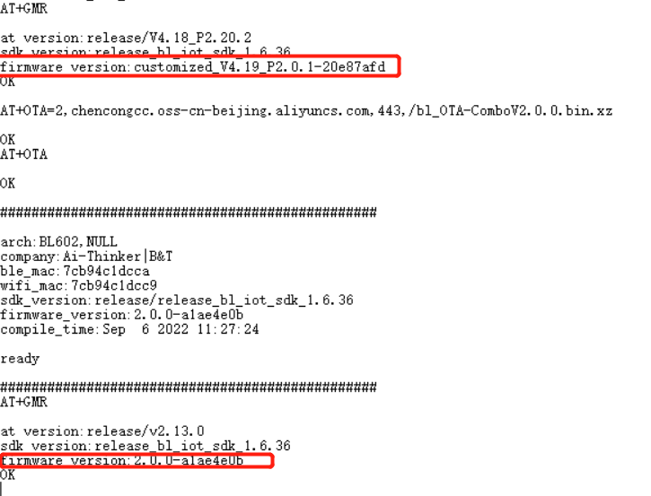
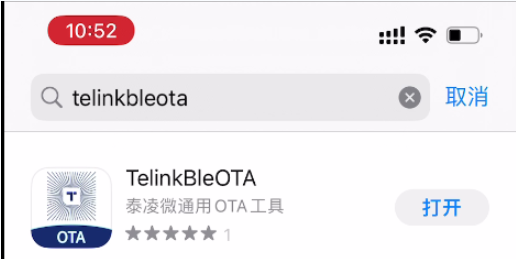
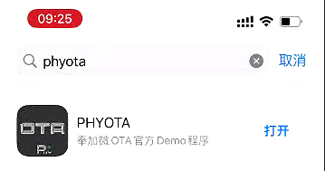

OTA AT 示例
====================================

本文档主要介绍在设备上运行 :doc:`../command-set/AT_Basic_Commands` 命令的详细示例。

.. contents::
   :local:
   :depth: 1

Wi-Fi系列模组OTA升级
-----------------------------------------------------
1. 设置模块的Wi-Fi 工作模式并保存到Flash

   命令：

   .. code-block:: none

      AT+WMODE=1,1

   响应：

   .. code-block:: none

      OK

2. 设置模块联网，参数填写有外网的Wi-Fi 名称和Wi-Fi 密码

   命令：

   .. code-block:: none

      AT+WJAP="Wi-Fi 名称","Wi-Fi 密码"

   响应：

   .. code-block:: none

      +EVENT:WIFI_CONNECT

      OK

3. 设置固件升级方式及固件地址

   命令：

   .. code-block:: none

      AT+OTA=2,chencongcc.oss-cn-beijing.aliyuncs.com,443,/bl_OTA-ComboV2.0.0.bin.xz

   响应：

   .. code-block:: none

      OK

4. 开始升级

   命令：

   .. code-block:: none

      AT+OTA

   响应：

   .. code-block:: none

      OK

**演示**

蓝牙TB系列模组的OTA升级
-----------------------------------------------------
1. APP下载：

   IOS系统的手机,可以在App Store商店搜索 TelinkBleOTA 获取

   Android系统的手机apk安装包下载:`手机apk安装包 <https://docs.ai-thinker.com/_media/tbota_app.zip>`__

   OTA升级文件下载:`OTA升级文件 <https://docs.ai-thinker.com/_media/1939_8258_com_at-v205_1_.zip>`__

2. 打开 TelinkBleOTA 软件，在Filter中进行设置,将rssi值限制在60dBm以内然后在返回主界面点击刷新按钮，找到对应的BLE蓝牙

  .. figure:: ../../_static/setFilter.png
    :scale: 80 %
    :alt: OTA_APP

  .. figure:: ../../_static/center.png
    :scale: 100 %
    :alt: OTA_APP

3. 搜到对应的蓝牙后点击CONNECT按钮进行连接,模块上打印+BLE_CONNECTED，表示APP与模块连接成功

  .. figure:: ../../_static/connect.png
    :scale: 80 %
    :alt: OTA_APP

4. 点击OTA Settings选项，打开Bin file path区域查看要OTA的文件，关于OTA文件的导入教程可以点击Choose Bin File界面中的感叹号进行查看

   .. figure:: ../../_static/OTA_setting2.png
    :scale: 80 %
    :alt: OTA_APP

5. 设置好OTA文件后点击下方的START按钮进行升级，等待进度条走到100%后模块会返回OTA_SUCCESS随后自动复位重启，打印新的版本，表示OTA升级成功

   .. only:: format_html

      .. figure:: ../../_static/OTAsetting.gif
       :scale: 80 %
       :alt: OTA_APP

   .. only:: format_latex

      .. figure:: ../../_static/OTAsetting.png
       :scale: 80 %
       :alt: OTA_APP

蓝牙PB系列模组的OTA升级
-----------------------------------------------------
1. APP下载：

   IOS系统的手机,可以在App Store商店搜索 PHYOTA 获取

   Android系统的手机apk安装包下载:`手机apk安装包 <https://docs.ai-thinker.com/_media/ota_.zip>`__

   OTA升级文件下载:`OTA升级文件 <https://docs.ai-thinker.com/_media/ota_.zip>`__

2. 为了方便测试，需要发送AT+BLENAME=123456和AT+RST指令将模组的广播名称设置成123456，并打开PHYOTA软件进行搜索

  .. figure:: ../../_static/PHY_set.png
    :scale: 80 %
    :alt: OTA_APP

  .. figure:: ../../_static/PHY_center.png
    :scale: 100 %
    :alt: OTA_APP

3. 搜索到名称为123456的蓝牙设备，点击右上角的停止按钮，选择名称为123456的蓝牙设备点击确定进入OTA升级界面

  .. figure:: ../../_static/PHY_connect.png
    :scale: 80 %
    :alt: OTA_APP

4. 点击选择文件，如果文件栏为空，可以将OTA文件放到微信或者QQ上，点击hex文件选择其他应用，找到PHYOTA软件，打开后即可成功获取到HEX文件，选择对应的HEX文件后点击开始升级

   .. only:: format_html

      .. figure:: ../../_static/PHY_OTA_SETT.gif
       :scale: 80 %
       :alt: OTA_APP

   .. only:: format_latex

      .. figure:: ../../_static/PHY_OTA_SETT.png
       :scale: 80 %
       :alt: OTA_APP
