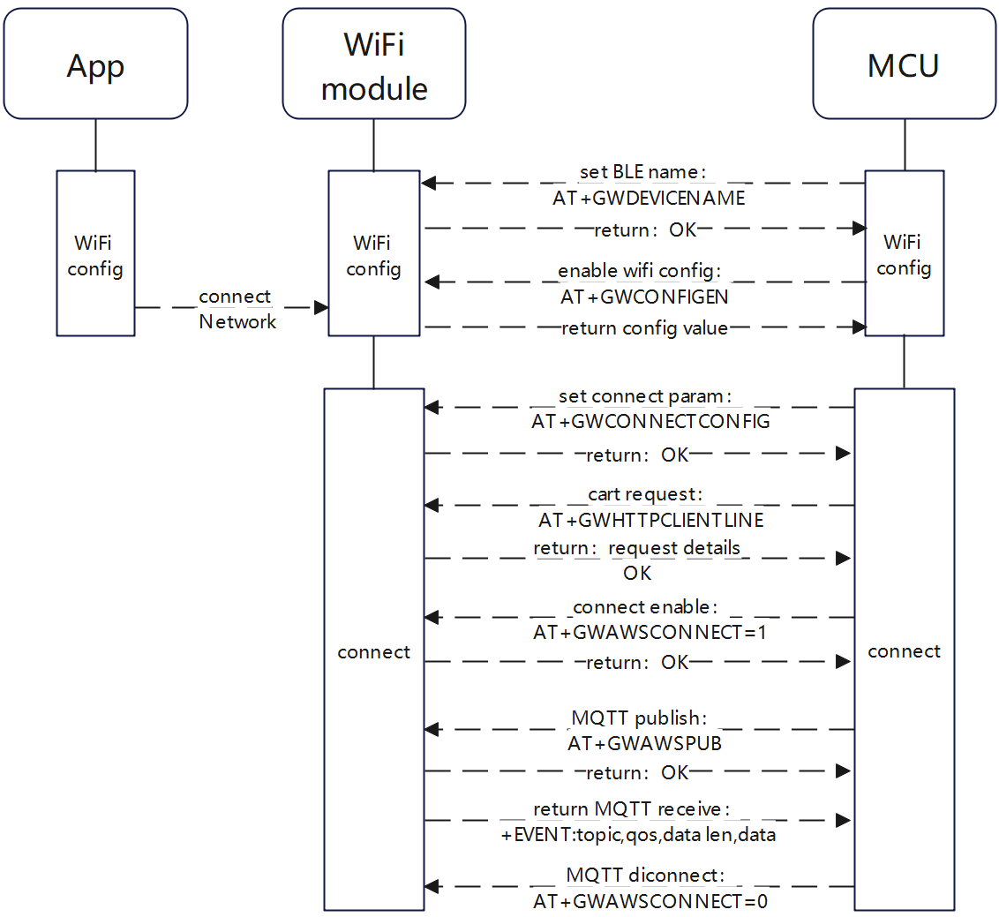

云平台对接示例
=================================

本文档介绍使用Combo-AT命令对接广云物联平台。

.. contents::
   :local:
   :depth: 1

.. Important::
  - 此示例针对不同的模组会有所不同的适配，具体差异请移步查询您手上的模组指令支持情况：:doc:`../instruction/other/firmware_differences`。

指令流程
------------------------------------------------------------------------

广云APP WIFI配网
------------------------------------------------------------------------

**BLE配网：**

1. 配置配网的蓝牙名称及PID, APP默认带名称过滤，名称需包含granwin字段

  命令：

  .. code-block:: none
    
    AT+GWDEVICENAME="granwin_dev",137

  响应

  .. code-block:: none

    OK

2. 启动配网，只支持BLE 配网

  命令：

  .. code-block:: none
    
    AT+GWCONFIGEN

  响应

  .. code-block:: none

    +EVENT:BLE_CONNECT

    +EVENT:BLE_DISCONNECT

    +EVENT:BLE_CONNECT

    +EVENT:WIFI_CONNECT

    +EVENT:WIFI_GOT_IP

    +EVENT:BLE_DISCONNECT

    OK

连接平台相关
------------------------------------------------------------------------

.. Important::
  - 连接云平台直线需要提前在广云天匠平台创建产品，创建时可获取 “productKey”，其他连接参数，需要向广云天匠工作人员提供授权参数后，才能获得“clientID”、“Secret”和"厂商PID"。

1. 配置连接参数

  命令：

  .. code-block:: none
    
   AT+GWCONNECTCONFIG="xxxxxxxxx","xxxxxxxxx","xxxxxxxxxxxx"

  响应

  .. code-block:: none

    OK

2. 证书请求

  命令：

  .. code-block:: none
    
    AT+GWHTTPCLIENTLINE

  响应

  .. code-block:: none

    +EVENT:GET TIME:1678693267532
    +EVENT:GET TOKEN SUCCESS
    +EVENT:GET PRIVATEKEY CART SUCCESS
    +EVENT:GET DEVICE CART SUCCESSS

    OK

3. 连接平台与断开连接

  连接平台命令：

  .. code-block:: none
    
    AT+GWAWSCONNECT=1 

  响应

  .. code-block:: none

    OK

     
  断开连接命令：

  .. code-block:: none
    
    AT+GWAWSCONNECT=0 

  响应

  .. code-block:: none

    OK

发布信息
------------------------------------------------------------------------
1. 发布信息

  发布更新命令：

  .. code-block:: none
    
    AT+GWAWSPUB=0,"{\"switch\":{\"type\":1,\"value\":1}}",1

  响应

  .. code-block:: none

    OK

 响应查询命令：

  .. code-block:: none
    
    AT+GWAWSPUB=1,"{\"switch\":{\"type\":1,\"value\":1}}",1

  响应

  .. code-block:: none

    OK

发布版本号命令：

  .. code-block:: none
    
    AT+GWAWSPUB=2,"1.0.1",1

  响应

  .. code-block:: none

    OK

接收数据
------------------------------------------------------------------------
1. 完成连接后已经自动订阅和相关Topic，平台下发的数据会通过直接返回。

  响应

  .. code-block:: none

    +EVENT:/user/get,1,61,{"data":{"switch":{"type":1,"value":1}},"time":1678871216899}

指令完整演示
------------------------------------------------------------------------

.. only:: format_html

   .. figure:: ../../_static/guangyun_AT_operation.gif
       :scale: 100 %
       :alt: guangyun_AT_operation

.. only:: format_latex

   .. figure:: ../../_static/guangyun_AT_operation.png
       :scale: 100 %
       :alt: guangyun_AT_operation